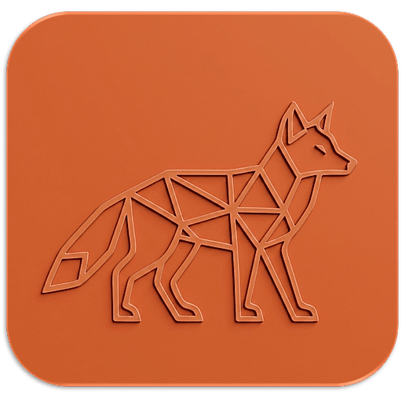
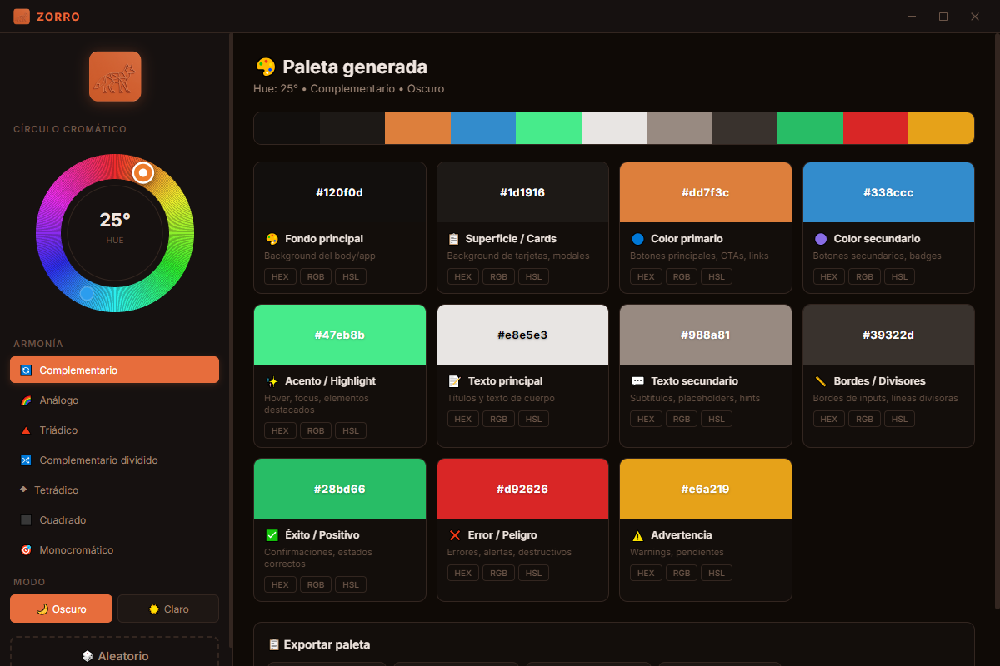

# 🦊 ZORRO — Generador de Paletas Profesionales



**ZORRO** es una aplicación de escritorio para Windows que genera paletas de colores profesionales a través de algoritmos sobre el círculo cromático. Cada color generado incluye su rol específico (fondo, texto, botones, etc.) para que tanto tú como la IA sepan exactamente para qué se usará cada color en el proyecto.

---

## 📸 Vista Previa

<p align="center">
  
</p>

*Círculo cromático interactivo con generación de paletas en tiempo real.*

---

## ✨ Características

### 🎡 Círculo Cromático Interactivo
- Selector SVG de 360° con arrastre suave
- Visualización de puntos de armonía en el círculo
- Display de grados en tiempo real

### 🎨 7 Algoritmos de Armonía
| Armonía | Descripción |
|---|---|
| 🔄 **Complementario** | Colores opuestos en el círculo |
| 🌈 **Análogo** | Colores vecinos, transición suave |
| 🔺 **Triádico** | Tres colores equidistantes |
| 🔀 **Complementario dividido** | Opuesto + sus vecinos |
| ◆ **Tetrádico** | Cuatro colores rectangulares |
| ⬛ **Cuadrado** | Cuatro colores equidistantes |
| 🎯 **Monocromático** | Un solo tono variando luminosidad |

### 🏷️ 11 Roles de Color
Cada color de la paleta tiene un propósito asignado:

| Rol | Uso |
|---|---|
| 🎨 **Fondo principal** | Background del body/app |
| 📋 **Superficie / Cards** | Background de tarjetas, modales |
| 🔵 **Color primario** | Botones principales, CTAs, links |
| 🟣 **Color secundario** | Botones secundarios, badges |
| ✨ **Acento / Highlight** | Hover, focus, elementos destacados |
| 📝 **Texto principal** | Títulos y texto de cuerpo |
| 💬 **Texto secundario** | Subtítulos, placeholders, hints |
| 📏 **Bordes / Divisores** | Bordes de inputs, líneas divisoras |
| ✅ **Éxito / Positivo** | Confirmaciones, estados correctos |
| ❌ **Error / Peligro** | Errores, alertas, destructivos |
| ⚠️ **Advertencia** | Warnings, pendientes |

### 📋 4 Formatos de Exportación
- **🎨 CSS Variables** — Listo para pegar en tu `:root {}`
- **🌊 Tailwind Config** — Objeto de colores para `tailwind.config.js`
- **📝 Texto completo** — HEX, RGB, HSL con descripción de cada rol
- **🤖 Prompt para IA** — Texto optimizado para pegar en tu chat con la IA

### 🎲 Generación
- **Aleatorio** — Un click, paleta completa nueva
- **Manual** — Arrastra el círculo cromático
- **Modo oscuro / claro** — Paletas optimizadas para cada modo

---

## 🛠️ Stack Tecnológico

| Tecnología | Uso |
|---|---|
| **Electron** | Runtime de escritorio |
| **React 19** | Interfaz de usuario |
| **Vite** | Build tool |
| **SVG** | Círculo cromático interactivo |
| **HSL Math** | Motor de generación de colores |

---

## 🚀 Cómo empezar

### Requisitos
- Node.js 18+
- Windows 10/11
- npm

### Instalación

```bash
# Clonar o descargar el proyecto
cd zorro

# Instalar dependencias
npm install

# Ejecutar en modo desarrollo
npm run start

# Compilar .exe portable
npm run dist
```

### Scripts disponibles

| Script | Acción |
|---|---|
| `npm run start` | Inicia Vite + Electron en desarrollo |
| `npm run dev` | Solo servidor Vite |
| `npm run build` | Compila React para producción |
| `npm run dist` | Genera `ZORRO.exe` portable en `/release` |

---

## 🔄 Flujo de trabajo

### Generar paleta para tu proyecto:

```
1. Abre ZORRO
2. Arrastra el círculo cromático o presiona 🎲 Aleatorio
3. Elige una armonía (complementario, triádico, etc.)
4. Selecciona modo oscuro o claro
5. Revisa la paleta generada con los 11 roles
6. Click en cualquier color para copiar el HEX
7. O exporta la paleta completa en el formato que necesites
```

### Usar con IA:

```
1. Genera tu paleta en ZORRO
2. Presiona "🤖 Prompt para IA"
3. Pega el texto al inicio de tu chat con la IA
4. La IA sabrá exactamente qué color usar para cada elemento
```

### Ejemplo de exportación (Prompt IA):

```
Paleta de colores para el proyecto:

- Fondo principal: #0f0e17 → Background del body/app
- Superficie / Cards: #1a1825 → Background de tarjetas, modales
- Color primario: #5e60ce → Botones principales, CTAs, links
- Color secundario: #e07a5f → Botones secundarios, badges
- Acento / Highlight: #81b29a → Hover, focus, elementos destacados
- Texto principal: #e6e2d8 → Títulos y texto de cuerpo
- Texto secundario: #8a8690 → Subtítulos, placeholders, hints
- Bordes / Divisores: #2a2835 → Bordes de inputs, líneas divisoras
- Éxito / Positivo: #2ecc71 → Confirmaciones, estados correctos
- Error / Peligro: #e74c3c → Errores, alertas, destructivos
- Advertencia: #f39c12 → Warnings, pendientes

Usa estos colores exactos en el diseño. Cada color tiene un
propósito específico asignado.
```

---

## 📂 Estructura del Proyecto

```text
├── assets/
│   ├── zorro.ico         # Icono de la aplicación
│   ├── zorro.png         # Logo PNG
│   └── view.png          # Captura de pantalla
├── main.cjs              # Proceso principal de Electron
├── preload.cjs           # Puente IPC (API Bridge)
├── src/
│   ├── engine/
│   │   └── colors.js     # Motor de generación de colores
│   ├── components/
│   │   ├── TitleBar.jsx   # Barra de título personalizada
│   │   ├── ChromaWheel.jsx # Círculo cromático SVG
│   │   ├── PaletteCard.jsx # Tarjeta de color individual
│   │   ├── ExportPanel.jsx # Panel de exportación
│   │   └── Toast.jsx      # Notificaciones
│   ├── App.jsx            # Componente raíz
│   ├── index.css          # Estilos globales
│   └── main.jsx           # Entry point React
├── index.html             # HTML base
├── package.json           # Dependencias y scripts
├── vite.config.js         # Configuración de Vite
├── electron-builder.yml   # Configuración del build
└── README.md              # Este archivo
```

---

## 🧮 Motor de Color

ZORRO usa matemáticas HSL para generar paletas armónicas:

```
HSL (Hue, Saturation, Lightness)
│
├── Hue (0-360°) → Posición en el círculo cromático
├── Saturation (0-100%) → Intensidad del color
└── Lightness (0-100%) → Claridad del color

Armonías:
├── Complementario → Hue + 180°
├── Análogo → Hue ± 30°
├── Triádico → Hue + 120°, Hue + 240°
├── Split → Hue + 150°, Hue + 210°
├── Tetrádico → Hue + 60°, + 180°, + 240°
├── Cuadrado → Hue + 90°, + 180°, + 270°
└── Mono → Solo varía S y L
```

---

## 🦊 Sobre el nombre

El **Zorro culpeo** (*Lycalopex culpaeus*) es el segundo cánido más grande de Sudamérica y habita a lo largo de Chile. Es astuto, adaptable y tiene un pelaje que va del naranja rojizo al gris — una paleta natural perfecta que inspiró los colores de esta aplicación.

---

## 👤 Autor

Desarrollado con ❤️ en Chile por **CoipoNorte**.

> "Un poquito del sure en el norte de Chile"

---

## 📄 Licencia

Proyecto de uso personal. Úsalo bajo tu responsabilidad.
